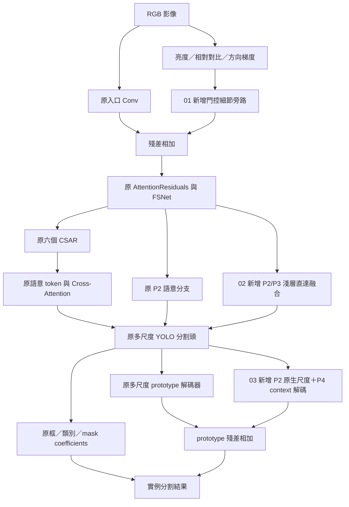

# 0929：以局部架構改動改善陰影凹損與完整範圍

本次新增 **三個有實際網路差異的版本，以及一個共同基準**。每組都有完整模型 YAML 與配套訓練 YAML。主幹仍為 AttentionResiduals → FSNetShuffle → 六個 CSAR → 四個 DamageSemanticAttention → 多標籤分割頭；局部增加亮度細節、淺層特徵直達頭部、P2 遮罩解碼三種旁路。

這些旁路在**訓練與推論時都會運算**，會增加參數與計算量。0928 版本主要改訓練 loss；0929 版本以增加訊息傳遞路徑為主，四組訓練參數與 loss 保持相同。

## 1. 哪些部分保留，哪些部分增加

| 部位 | 本次處理 |
|---|---|
| 入口原 RGB Conv | 保留計算、權重名稱與形狀，旁邊新增亮度細節殘差 |
| layer 1～20 | 原定義、連接、索引完整保留，包含 AttentionResiduals、FSNetShuffle 與六個 CSAR |
| layer 21～32 | 四個語意 token 分支與 Index 路由完整保留 |
| head layer 33 | 原框、類別、mask coefficient 路徑保留；02／03 增加淺層輸入與融合 |
| 原 Proto26MultiLabel | 原多尺度融合、轉置卷積上採樣、原型與輔助輸出權重保留 |
| 03 的 prototype 旁路 | 新增 P2 投影與 P4 context 融合，在 P2 尺度輸出原型殘差 |
| 類別與尺度 | 八類順序沿用 B/C/D/H/O/R/X/U；P3/P2/P4/P5 順序保留 |
| 輸出 | 仍為標準框、類別、實例遮罩；640 輸入時 prototypes 為 160×160 |

因此，「主架構不動」在此指核心模組、主要連接和既有預測路徑保留；整個網路已因新增旁路而改變，不能再視為參數完全相同的六個設定。

## 2. 四組完整模型與訓練檔

| 編號 | 完整模型 YAML | 配套訓練 YAML | 架構內容 |
|---|---|---|---|
| 00 | [00-baseline](../ultralytics/cfg/models/11_myself/yolo11-6csar-arch-0929-00-baseline.yaml) | [00-baseline](../ultralytics/cfg/experiments/damage-arch-0929/00-baseline.yaml) | 原 semantic-token 架構，作為對照 |
| 01 | [01-luma](../ultralytics/cfg/models/11_myself/yolo11-6csar-arch-0929-01-luma.yaml) | [01-luma](../ultralytics/cfg/experiments/damage-arch-0929/01-luma.yaml) | 原架構＋亮度細節入口旁路 |
| 02 | [02-shallow](../ultralytics/cfg/models/11_myself/yolo11-6csar-arch-0929-02-shallow.yaml) | [02-shallow](../ultralytics/cfg/experiments/damage-arch-0929/02-shallow.yaml) | 01＋P2/P3 淺層直達頭部旁路 |
| 03 | [03-dualproto](../ultralytics/cfg/models/11_myself/yolo11-6csar-arch-0929-03-dualproto.yaml) | [03-dualproto](../ultralytics/cfg/experiments/damage-arch-0929/03-dualproto.yaml) | 02＋保留 P2 尺度的第二條遮罩解碼路徑 |

03 是本輪完整候選架構，00～02 用於分辨每一處新增路徑是否有幫助；編號不代表已驗證的準確率排名。比較時，各組都從同一 `last0926.pt` 出發，使用相同資料切分，不依次載入前一組的 best.pt。

## 3. 新架構的資料流



圖中的 head 特徵包含原語意增強訊號；P2 分支仍直接從原 layer 2 讀取，沒有改成一定經過 CSAR。02 額外讀取 FSNet 的 layer 6（P3）與 layer 3（P2），補充另一條局部細節來源。

## 4. 三項局部架構修改的目的與過程

### 01：原 RGB Conv 旁新增亮度細節分支

模型第一層由 `Conv` 改為繼承它的 `LuminanceResidualStem`。原 RGB 卷積完整執行；另一分支重用專案的 `LuminanceDetail`，提取五個通道：亮度、5×5／15×15 相對對比、水平／垂直方向梯度。

亮度近似為 `Y=0.299R+0.587G+0.114B`。令 μₖ 為 k×k 局部平均、ε=1/255，相對對比為：

\[
C_k=\tanh\left(\frac{Y-\mu_k}{\mu_k+\epsilon}\right).
\]

局部平均讓分支能表達「比周圍亮或暗多少」；分母下限與 tanh 限制暗處訊號放大，方向梯度保留明暗變化的方向。它們提供陰影中的形狀線索，但也會對貨櫃溝槽、陰影邊界及污漬產生響應，並非凹損或深度的直接量測。

五通道特徵經 Conv 與 depthwise convolution 得到 D，原 RGB Conv 輸出為 F：

\[
F'=F+\tanh(\alpha)\,\sigma(W_g[F,D])\odot D.
\]

α 初始為 0.1、門控初始為 0.5，原訊號始終保留，新訊號的使用方式由標記監督學習。相對對比在部分亮度變化下可能較穩定；這不是嚴格光照不變性，也不是對照片先做亮度增強再存檔。

專案原有 ShadowIIMStem 會使用 IIM 主路。本次以原 RGB Conv 為主路，避免因換掉入口核心計算而超出保留主架構的範圍。另實作 `forward_fuse`，確保部署前融合 Conv/BN 時不會略過新旁路。

### 02：新增 P2/P3 淺層特徵直達分割頭

在 01 上將 head 改為現有的 `Segment26MultiLabelShadow`，輸入由八路增加到十路，末兩路接 layer 6 與 layer 3。原預測頭仍收到原有語意增強特徵；`DentDetailFusion` 另將淺層特徵投影，計算 3×3／7×7 局部差異，再門控加回 P3/P2。

\[
\Delta_3=S-\operatorname{Avg}_3(S),\quad
\Delta_7=S-\operatorname{Avg}_7(S),\quad
F'=F+\tanh(\alpha)G\odot\phi([S,\Delta_3,\Delta_7]).
\]

這是新增連接與卷積融合，而非只提高既有特徵的權重。目的在於讓微弱凹損的局部紋理和方向變化有直接進入框、分類、mask coefficient 與 prototype 路徑的機會。低階紋理也包含背景溝槽，是否降低漏檢而不增加誤報仍須比較驗證。

淺層細節與深層語意的結合可參考 [FPN 的側向連接](https://arxiv.org/abs/1612.03144)。本次是依本專案現有模組所做的局部設計，沒有引用該論文的成效數字作為本資料集結果。

### 03：原 prototype 解碼器旁新增 P2 尺度解碼器

原 `Proto26MultiLabel` 把各尺度特徵融合到 P3，再上採樣到 P2。原本已存在 P2 輸入與 160×160 輸出，但 P2 細節在原解碼路徑中會先降到 P3 尺度。

本次 `DualPathP2Proto` 保留這條原路徑和全部權重，新增直接處理 P2 的分支：

\[
D=\operatorname{Conv}_{1\times1}(F_{P2}),\qquad
C=\operatorname{Resize}_{P2}(\operatorname{Conv}_{1\times1}(F_{P4})),
\]
\[
G=\sigma(W_g[D,C]),\qquad
\Delta P=W_o\operatorname{DWConv}_{3\times3}(D+C),\qquad
P'=P_{old}+\tanh(\beta)G\odot\Delta P.
\]

D 保存較細的空間資訊；C 引入較大範圍的語意，幫助模型判斷哪些局部變化值得使用；ΔP 輸出 32 個 prototype 通道，與原 P 相加。這裡沒有以鏽蝕類別機率作為硬門檻，凹損不必同時存在鏽蝕。

實例遮罩仍由 `zᵢ=Σₖ cᵢₖP′ₖ` 產生。新增路徑受到最終實例 mask loss 的梯度，而非只畫一張輔助熱圖。目的在於補充完整範圍與輪廓資訊；它不把框填滿，也不固定膨脹遮罩。

高解析度定位資訊與上下文共同參與解碼的方向可參考 [U-Net](https://arxiv.org/abs/1505.04597)。本次並未改成 U-Net；原頭仍保留，且最終 prototype 尺寸沒有增加。

## 5. 與 0928 loss 版本如何區分

| 項目 | 0928 系列 | 本次 0929 系列 |
|---|---|---|
| 主要改動 | 陰影／一致性／範圍／邊界 loss 與解析度對照 | 新增入口、淺層直達、原型解碼旁路 |
| 網路圖與參數 | 六組相同 | 01～03 逐步增加實際模組與連接 |
| 推論成本 | 同解析度時沒有附加訓練 loss 成本 | 新旁路需要額外推論運算 |
| 實驗控制 | 比較不同訓練方法 | 固定相同訓練方式比較架構 |

本次四組均使用原本的多標籤分割 criterion，保留獨立 D/R 與原共現監督，沒有加入 `training_aux`。請不要直接把 0928 的 `training_aux` 貼進 02／03：目前該訓練管線刻意限制使用原 `Segment26MultiLabel` 頭，尚未宣稱與新增 head 的成對訓練相容。先完成架構比較，再決定是否另做結合實驗。

## 6. 訓練方法與權重移植

使用這份專案的 Python 環境與 `yolo` 命令。訓練主機需同步新檔 [damage_architecture.py](../ultralytics/nn/modules/damage_architecture.py)、修改後的 [modules/__init__.py](../ultralytics/nn/modules/__init__.py)、[tasks.py](../ultralytics/nn/tasks.py)、八個 YAML，以及既有 `shadow_dent.py`、語意模組與其依賴。僅複製 YAML 到官方原版套件不會有新模組。

四組訓練設定只有 model 與 name 不同，其他設定相同：imgsz=640、epochs=200、batch=4、AdamW、lr0=0.0003、seed=928、overlap_mask=false、mask_ratio=4、amp=false、compile=false。它們是控制實驗的起點，並非已驗證最佳參數。參數少量增加不代表執行時間只會增加相同比例；全影像局部平均與原生 P2 分支仍有計算與顯存成本。

以下 PowerShell 從專案根目錄執行，四組都使用同一份起始權重：

```powershell
$damageData = Read-Host '請輸入已核對完整實例分割標記的 data.yaml 路徑'
$damageWeights = 'C:/Users/USER/Downloads/last0926.pt'
$damageCfg = 'ultralytics/cfg/experiments/damage-arch-0929'
if (-not (Test-Path -LiteralPath $damageData -PathType Leaf)) { throw '找不到 data.yaml' }
if (-not (Test-Path -LiteralPath $damageWeights -PathType Leaf)) { throw '找不到起始權重' }
foreach ($damageStage in @('00-baseline', '01-luma', '02-shallow', '03-dualproto')) {
    yolo segment train "cfg=$damageCfg/$damageStage.yaml" "data=$damageData" "pretrained=$damageWeights" device=0
    if ($LASTEXITCODE -ne 0) { throw "訓練失敗：$damageStage" }
}
```

只先訓練完整候選 03 時，可在設定上述變數後使用：

```powershell
yolo segment train "cfg=$damageCfg/03-dualproto.yaml" "data=$damageData" "pretrained=$damageWeights" device=0
```

`pretrained` 讓 trainer 依資料類別數建立新模型後載入舊權重。新增分支尚未出現在 last0926.pt 中，必須訓練；舊主幹和原 head 權重均保留同名同形。這是部分載入到擴充後模型，不能再稱為新模型整體 `strict=True` 載入。八類順序應保持 B/C/D/H/O/R/X/U，D=2、R=5。

## 7. 資料與成效判讀

新 XML 的 25 個 D、69 個 R 仍是定位參考，不能直接提供精細分割 GT。完整範圍標記應圈出可辨識的完整凹損，而非只圈最暗點；重疊 D/R 各自保留 polygon。資料核對方式沿用 [0928 說明](damage-extent-0928.md)。本輪未改寫標記、原圖或舊 YAML，照片分數預設隱藏也維持不變。

應用固定驗證集比較陰影 D 召回率、精確率、mask IoU、前景覆蓋與背景誤塗，另檢查 D/R 共現區域。原案例若仍在 train 集，適合作為除錯圖，不能代替獨立測試。架構能提供更多資訊路徑，但不能保證一張照片就能區分凹損、陰影、溝槽，也無法憑空還原不可見的表面。

## 8. 已完成的程式驗證

- 新增 14 項測試，涵蓋旁路梯度、增益關閉等價、原權重 key／shape、類別與 n/s 尺度覆寫、空標記、非正方形輸入、驗證 loss、EMA、checkpoint 重載、export tensor 契約與 FP16 推論。
- 新增與相關回歸測試共 **93 項通過**。舊 semantic、shadow、extent 與 training_aux 測試亦通過。
- 特別測試 Conv/BN fuse 後的入口旁路仍有效，fuse 前後輸出在數值容許範圍內一致。
- 所有旁路增益設為零、載入相同基底權重後，03 的框／類別／係數與 prototype 輸出能精確回到基底。
- export 測試只檢查模型的匯出張量契約；尚未執行 ONNX／TensorRT 匯出及部署驗證。
- 尚未執行完整 GPU 訓練，亦未建立新方法的準確率、FPS 或顯存結論。

重跑測試：

```powershell
$env:OMP_NUM_THREADS = '2'
$env:MKL_NUM_THREADS = '2'
& '.venv-shadow-check/Scripts/python.exe' -m pytest `
  tests/test_damage_architecture.py tests/test_damage_semantic.py tests/test_shadow_dent.py `
  tests/test_damage_extent.py tests/test_training_aux_0918.py --noconftest -o addopts= -q
```

計畫與規格：[實作計畫](superpowers/plans/2026-09-29-damage-architecture.md)、[架構規格](superpowers/specs/2026-09-29-damage-architecture.md)。

## 9. 實際 last0926.pt 與 640 輸入檢查

使用八類、n 規模與實際權重檢查，原 checkpoint 的 **999/999 個 state entries** 在四組中均同名同形載入並逐值一致；新分支另行初始化。

| 版本 | 參數量 | 相較基底新增 | 新增比例 |
|---|---:|---:|---:|
| 00-baseline | 6,302,676 | 0 | 0.000% |
| 01-luma | 6,303,638 | 962 | 0.015% |
| 02-shallow | 6,378,586 | 75,910 | 1.204% |
| 03-dualproto | 6,394,044 | 91,368 | 1.450% |

四組皆完成 [1,3,640,640] 低亮度隨機輸入的 forward，框／類別／係數張量為 [1,44,34000]，prototype 為 [1,32,160,160]，數值皆有限。這是形狀與數值檢查，並非真實影像準確率測試，也未據此推算 FPS。

[檢查記錄](../runs/damage_arch_0929/architecture_checks.json)與[檢查腳本](../runs/damage_arch_0929/check_architecture.py)儲存在本機 runs 目錄；此目錄不納入 Git。
